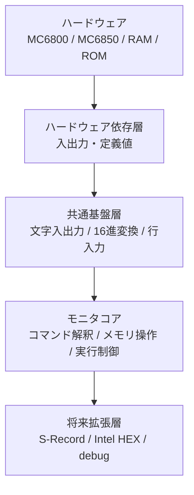
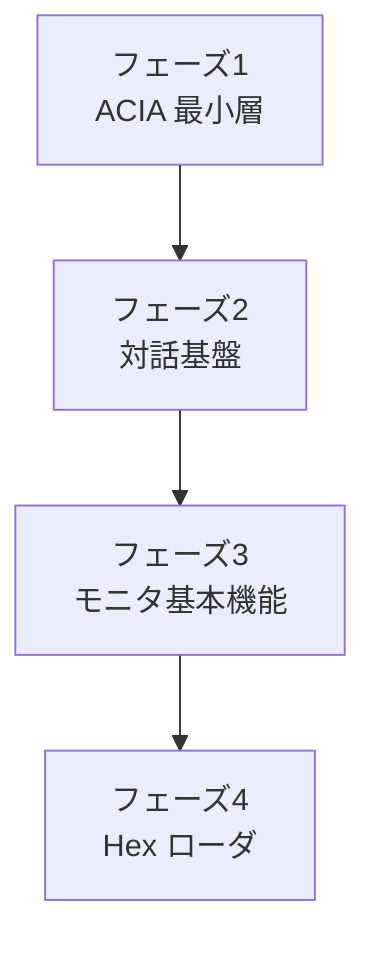

# モニタアーキテクチャ

## 目的

MC6800 ROM モニタを、小さな ROM でも段階的に拡張しやすい形で構成するための設計メモ。

## 全体像



## 層ごとの役割

### 1. ハードウェア依存層

対象ファイル:

- [include/hardware.inc](/Users/kuninet/git/MC6800_monitor/include/hardware.inc)
- [src/acia6850.asm](/Users/kuninet/git/MC6800_monitor/src/acia6850.asm)

役割:

- RAM / ROM / I/O アドレス定義
- ACIA の初期化
- 1 文字送信
- 1 文字受信
- 起動時の最小確認

ここはターゲットボード差分を吸収する場所と考える。

### 2. 共通基盤層

想定する機能:

- 1 行入力
- バックスペース処理
- CR / LF の正規化
- 16 進文字のデコード
- 数値文字列の変換
- 短いメッセージ出力

ここは CLI とローダの両方から使う共通部品になる。

### 3. モニタコア

想定する機能:

- コマンドディスパッチ
- メモリダンプ
- メモリ変更
- 指定アドレス実行
- 将来のレジスタ表示や簡易状態表示

フェーズ2以降で中心になる層。

### 4. 将来拡張層

想定する機能:

- Motorola S-Record ロード
- Intel HEX ロード
- 保存機能
- ソフトウェアブレーク
- ステップ実行
- ビデオ出力対応

ROM 制約が厳しいので、初版ではここを切り離して考える。

## 初版フェーズ1の位置づけ

現在の実装はこの範囲。


これはモニタ全体の最小骨格であり、CLI やローダを載せる前の土台に相当する。

## 初版フェーズ2以降の見通し



## データの流れ

### 入力系

```text
端末入力
  -> ACIA 受信
  -> 1文字入力ルーチン
  -> 行入力 / 16進変換
  -> コマンド解釈
  -> メモリ操作 / 実行制御
```

### 出力系

```text
モニタ状態
  -> メッセージ生成
  -> 文字出力ルーチン
  -> ACIA 送信
  -> 端末表示
```

## 設計上のポイント

- ボード依存部はできるだけ定義ファイルと最小ルーチンへ押し込む
- 高機能化しても、基本の文字入出力ルーチンは小さく保つ
- コマンド処理とローダ処理は共通の 16 進変換を使う
- ROM 制約が厳しいため、重い機能はフェーズごとに追加する

## 今後の分離候補

- `src/platform/` へのボード依存部の分離
- `src/monitor/` へのコマンド処理分離
- `src/loader/` への S-Record / Intel HEX 分離
- `include/config.inc` のようなビルド時設定ファイル追加

## 関連ドキュメント

- メモリマップ: [memory_map.md](/Users/kuninet/git/MC6800_monitor/docs/design/memory_map.md)
- 要件: [../requirements/monitor_requirements.md](/Users/kuninet/git/MC6800_monitor/docs/requirements/monitor_requirements.md)
- 実装計画: [../plans/implementation_plan.md](/Users/kuninet/git/MC6800_monitor/docs/plans/implementation_plan.md)
