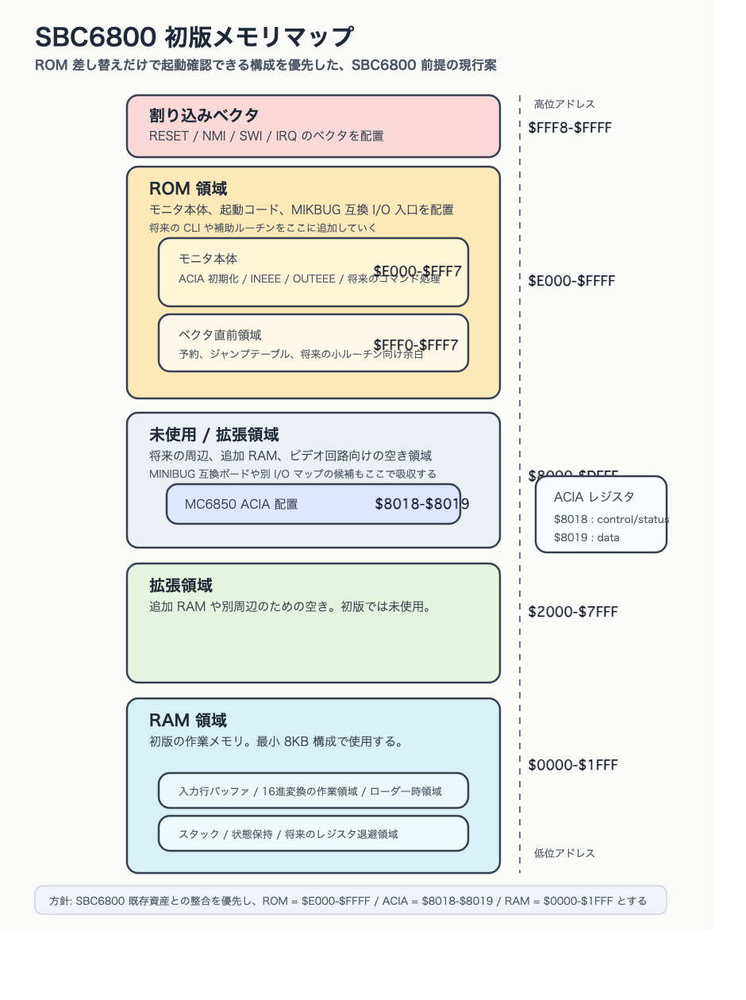

# 初版メモリマップ案

## 方針

当面の動作確認ターゲットは SBC6800 とする。ROM 差し替えだけで起動確認できることを優先し、SBC6800 の既存メモリマップに合わせる。

## 全体像

## SBC6800 前提の現行案

| 領域 | アドレス | 用途 |
| --- | --- | --- |
| RAM | `$0000-$1FFF` | 8KB 最小構成の主 RAM |
| 拡張領域 | `$2000-$7FFF` | 将来拡張用の RAM / I/O |
| ACIA | `$8018-$8019` | MC6850 ACIA |
| 予備 I/O / 未使用 | `$8000-$DFFF` | ボード依存領域 |
| ROM | `$E000-$FFFF` | モニタ本体と割り込みベクタ |

## MC6850 ACIA 配置案

| レジスタ | アドレス | 用途 |
| --- | --- | --- |
| control/status | `$8018` | 初期化、送受信状態確認 |
| data | `$8019` | 送受信データ |

これは SBC6800 用 MIKBUG / PROM680 サンプルと整合する値で、既存ボードに対する ROM 差し替え確認を優先するために採用する。

## ROM を `$E000-$FFFF` に置く理由

- SBC6800 の既存ソフト資産に合わせやすい
- リセットベクタを含む最上位アドレス帯を ROM で素直に覆える
- ROM 差し替えで動作確認しやすい

ROM 内の概略は、上の全体図の中でモニタ本体、ベクタ直前領域、割り込みベクタに分けて示している。

## RAM の使い方

初版では、次のような RAM 使用を想定する。

- 入力行バッファ
- ロード用一時バッファ
- 16 進変換の作業領域
- 必要最小限の状態保持
- スタック

合計で 1KB 程度を上限目安にする。

作業 RAM の概略も、上の全体図で入力バッファ、作業領域、スタック用途を含めて示している。

## ビルド時可変にしたい定義

- ROM base
- RAM start
- RAM end
- ACIA control/status address
- ACIA data address
- 行末判定種別
- ターゲットボード種別

## 補足

- 2KB ROM を主目標とする方針は維持するが、SBC6800 での初期動作確認中は `$E000-$FFFF` の ROM 空間を前提にする
- MINIBUG 互換ボード向けの配置は別課題として保留する

## 将来拡張

- ビデオ出力ビルドでは別の I/O マップ定義を使う
- MINIBUG 互換ボード向けには別のメモリマップを定義する
- デバッグ支援回路を入れる場合はターゲットごとに I/O アドレス方針を分ける

## 関連ドキュメント

- 要件: [../requirements/monitor_requirements.md](/Users/kuninet/git/MC6800_monitor/docs/requirements/monitor_requirements.md)
- 実装計画: [../plans/implementation_plan.md](/Users/kuninet/git/MC6800_monitor/docs/plans/implementation_plan.md)
- アーキテクチャ: [architecture.md](/Users/kuninet/git/MC6800_monitor/docs/design/architecture.md)
