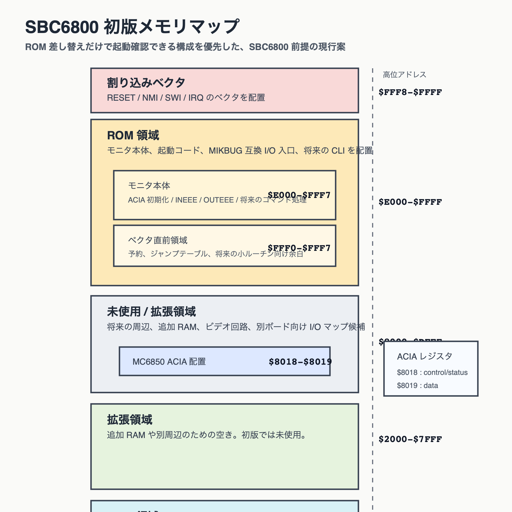

# 初版メモリマップ案

## 方針

当面の動作確認ターゲットは SBC6800 とする。ROM 差し替えだけで起動確認できることを優先し、SBC6800 の既存メモリマップに合わせる。

## 全体像

## SBC6800 前提の現行案

| 領域 | アドレス | 用途 |
| --- | --- | --- |
| RAM | `$0000-$1FFF` | 8KB 最小構成の主 RAM |
| 拡張領域 | `$2000-$7FFF` | 将来拡張用の RAM / I/O |
| ACIA | `$8018-$8019` | MC6850 ACIA |
| 予備 I/O / 未使用 | `$8000-$DFFF` | ボード依存領域 |
| ROM | `$E000-$FFFF` | モニタ本体と割り込みベクタ |

## MC6850 ACIA 配置案

| レジスタ | アドレス | 用途 |
| --- | --- | --- |
| control/status | `$8018` | 初期化、送受信状態確認 |
| data | `$8019` | 送受信データ |

これは SBC6800 用 MIKBUG / PROM680 サンプルと整合する値で、既存ボードに対する ROM 差し替え確認を優先するために採用する。

## ROM を `$E000-$FFFF` に置く理由

- SBC6800 の既存ソフト資産に合わせやすい
- リセットベクタを含む最上位アドレス帯を ROM で素直に覆える
- ROM 差し替えで動作確認しやすい

ROM 内の概略は、上の全体図の中でモニタ本体、ベクタ直前領域、割り込みベクタに分けて示している。

## ROM 内の現行方針

現行実装では、`$E000-$FFFF` の 8KB ROM 空間を次のように使う。

| 領域 | アドレス | 用途 |
| --- | --- | --- |
| MIKBUG 互換ページ | `$E000-$E1FF` | 固定エントリ番地互換用の予約領域 |
| モニタ本体 | `$E200-$FFF7` | コマンド処理、ローダ、共通ルーチン |
| 割り込みベクタ | `$FFF8-$FFFF` | IRQ / SWI / NMI / RESET ベクタ |

`$E000-$E1FF` は 512 バイトで、SBC6800 データパック互換のための MIKBUG 固定入口を置くページとして扱う。

現在このページで使用している入口は次の通り。

- `OUTCH = $E075`
- `INCH = $E078`
- `PDATA1 = $E07E`
- `CONTRL = $E0E3`
- `INEEE = $E1AC`
- `OUTEEE = $E1D1`

この領域の未使用部分は、将来の MIKBUG 互換拡張用に予約する。
当面は、一般的な新機能や大きな文字列テーブルを安易に詰め込まず、互換入口追加の余地を残す方針とする。

## RAM の使い方

初版では、次のような RAM 使用を想定する。

- 入力行バッファ
- ロード用一時バッファ
- 16 進変換の作業領域
- 必要最小限の状態保持
- スタック

合計で 1KB 程度を上限目安にする。

作業 RAM の概略も、上の全体図で入力バッファ、作業領域、スタック用途を含めて示している。

## SDFS/68 固定領域16KB拡張時の配置 (ram64_4000_work)

SDFS/68 拡張で 16KB 固定領域（`$4000-$7FFF`）を割り当てる `ram64_4000_work` 構成では、次のような配置になります。

| 領域 | アドレス | 用途 |
| --- | --- | --- |
| ユーザーTPA | `$0000-$3FFF` | ユーザープログラムのロード・実行範囲 (16KB) |
| バッファ / ワーク | `$4000-$7FFF` | SDFS/68 の常駐固定領域 (16KB) |
| 　(SDバッファ窓) | `$C000` または `$A000` | バンクメモリ窓のベース番地（SD_SECTOR_BUFなど） |
| 　(モニタワーク) | `$4200-$42FF` | モニタの作業変数領域 |
| 　(MIKBUGワーク) | `$4300-$43FF` | MIKBUG互換の変数領域 |
| 　(stage1 loader) | `$4400-$4FFF` | stage1 起動ローダー領域 (3KB) |
| 　(SDFSロード領域) | `$5000-$7EFF` | SDFS.BIN 本体のロード範囲 (11.75KB) |
| 　(スタック領域) | `$7FFF` に向けて下降 | 常駐システム用スタック |

### 16KB固定領域構成（ram64_4000_work）の設計趣旨

このメモリ配置には、システムの将来拡張性と安定性を両立させるための以下の意図があります。

1. **SDFS/68の機能拡張のための容量確保**:
   従来の8KB構成（`ram64_c000_work`等）では常駐SDFS本体のサイズ上限が約3.75KBに厳しく制限されていましたが、固定システム領域を16KB（`$4000-$7FFF`）に拡大し、SDFSロード範囲を `$5000-$7EFF` (約11.75KB) とすることで、将来のFAT32書込み（write）やSAVE実装に必要なコードサイズの成長（約10KB前後）に対応可能な容量的余地を確保しています。

2. **システムの安定性と堅牢性の向上**:
   常時アクセスが必要なモニターの作業変数やシステム用のスタックを、常駐SDFS本体と地続きの固定RAM領域である `$4200-$43FF` や `$7FFF` に集約しています。これにより、ジャンパピン切り替えやバンクメモリ制御の影響を受けず、システムの暴走を防ぎ、一貫した動作を保証します。

3. **バンクメモリの有効活用によるメモリ効率化**:
   常駐システム領域の拡大によりユーザーTPAが `$0000-$3FFF` (16KB) に狭まる影響を最小限にするため、512バイトのセクタバッファ（`SD_SECTOR_BUF`）のみをバンク窓である `$C000` または `$A000` に残しています。これにより、貴重な固定RAMをバッファ用途に消費させない高効率なメモリ利用を実現しています。

## ビルド時可変にしたい定義

- ROM base
- RAM start
- RAM end
- ACIA control/status address
- ACIA data address
- 行末判定種別
- ターゲットボード種別

## 補足

- 2KB ROM を主目標とする方針は維持するが、SBC6800 での初期動作確認中は `$E000-$FFFF` の ROM 空間を前提にする
- MINIBUG 互換ボード向けの配置は別課題として保留する

## 将来拡張

- ビデオ出力ビルドでは別の I/O マップ定義を使う
- MINIBUG 互換ボード向けには別のメモリマップを定義する
- デバッグ支援回路を入れる場合はターゲットごとに I/O アドレス方針を分ける

## 関連ドキュメント

- 要件: [../requirements/monitor_requirements.md](/Users/kuninet/git/MC6800_monitor/docs/requirements/monitor_requirements.md)
- 実装計画: [../plans/implementation_plan.md](/Users/kuninet/git/MC6800_monitor/docs/plans/implementation_plan.md)
- アーキテクチャ: [architecture.md](/Users/kuninet/git/MC6800_monitor/docs/design/architecture.md)
