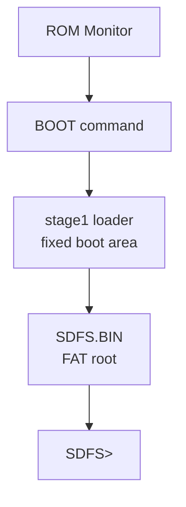

# ビルド手順

この文書は、どの `make` コマンドでどのROMを作るかを整理する。
設計上の詳細な構成軸は [build_configuration_axes.md](../development/build_configuration_axes.md) を参照する。

## まず使う入口

通常は `MONITOR_PROFILE` を使う。
直接指定の `MEMORY_CONFIG` / `BOARD_IO` / `FEATURE_*` は、新しい組み合わせを試すときや、profile化する前の確認に使う。

ROMモニタ、stage1、SDFS/68本体は生成物も責務も分かれている。
ROMだけを焼けば低レベルのメモリ操作とデバッグはできるが、SDFS/68の通常運用には stage1 と `SDFS.BIN` を入れた system SD が必要である。



ROMへ焼く場合、`make bin` を先に実行する必要はない。
`make rombin` は必要なアセンブルを内部で実行し、ROMライタ用の容量合わせ済みバイナリを作る。
`make program` は `rombin` を作ってからROMライタへ書き込む。

| やりたいこと | コマンド例 | 補足 |
| --- | --- | --- |
| エミュレータやテスト用のROM本体を作る | `make bin` | `build/mc6800-monitor.bin` を作る |
| ROMライタ用ファイルだけ作る | `MONITOR_PROFILE=sbcio make rombin ROM_KIND=W27C512` | 容量合わせ済みの `*-W27C512.bin` を作る |
| ROMへ書く | `MONITOR_PROFILE=sbcio make program ROM_KIND=W27C512` | `rombin` 生成後に `minipro` で書く |

実運用では、書き込み前に生成物を確認できるよう、次の2段階を基本にする。

```sh
MONITOR_PROFILE=sbcio make rombin ROM_KIND=W27C512
MONITOR_PROFILE=sbcio make program ROM_KIND=W27C512
```

急いでいる場合は、`program` だけでも必要な `rombin` は自動生成される。

```sh
MONITOR_PROFILE=sbcio make program ROM_KIND=W27C512
```

`make bin` は生成したROM本体のサイズを確認し、既定では `ROM_CODE_LIMIT=8192` を超えると失敗する。これは27C64互換の8KB ROMに収まらない変更を早期に検出するためである。`make rombin` と `make program` も同じ確認を通ってから容量合わせ済みイメージを作る。サイズ上限を一時的に無効化して調査したい場合だけ、明示的に `ROM_CODE_LIMIT=0` を指定する。

```sh
ROM_CODE_LIMIT=0 make bin
```

| 作りたいROM | コマンド | 主な出力 |
| --- | --- | --- |
| SBC6800互換の最小ROM | `make bin` | `build/mc6800-monitor.bin` |
| SBC-IO + 2nd ACIAキーボード | `MONITOR_PROFILE=sbcio make bin` | `build/mc6800-monitor-sbcio.bin` |
| SBC-IO + K68-VDG、VRAM `$A000-$BFFF` | `MONITOR_PROFILE=sbcio_vdg make bin` | `build/mc6800-monitor-sbcio-vdg.bin` |
| K6802-SBC + K68-VDG、VRAM `$C000-$DFFF` | `MONITOR_PROFILE=k6802_vdg make bin` | `build/mc6800-monitor-k6802-vdg.bin` |
| SBC-IO + 16KB固定構成 (VRAM `$A000-$BFFF` 想定) | `MONITOR_PROFILE=sbcio_4000 make bin` | `build/mc6800-monitor-sbcio-4000.bin` |
| K6802 + 16KB固定構成 (VRAM `$C000-$DFFF` 想定) | `MONITOR_PROFILE=k6802_4000 make bin` | `build/mc6800-monitor-k6802-4000.bin` |

## profileごとの違い

`FEATURE_SD=1` は raw SD sector read と `BOOT` の前提、`FEATURE_FAT=1` はROM常駐FAT `DIR` / `LF` を含める直接指定用の互換設定である。
標準profileではROM FATを本線から外す。`base` / `sbcio` はSDなし、`sbcio_vdg` / `k6802_vdg` はROM FATなしで `BOOT + SDFS/68` を本線にするprofileとして扱う。

| `MONITOR_PROFILE` | 位置づけ | ROM FAT `DIR`/`LF` | `BOOT` | system SD要否 | 主な用途 |
| --- | --- | --- | --- | --- | --- |
| `base` | SDなしの最小ROM | なし | なし | 不要 | SBC6800互換の低レベル操作 |
| `sbcio` | SBC-IO RAM拡張profile | なし | なし | 不要 | SBC-IO RAM拡張と2nd ACIAキーボード |
| `sbcio_vdg` | `BOOT + SDFS/68` 本線profile | なし | あり | 必要 | SBC-IO + K68-VDG + SDFS/68 |
| `k6802_vdg` | `BOOT + SDFS/68` 本線profile | なし | あり | 必要 | K6802-SBC + K68-VDG + SDFS/68 |
| `sbcio_4000` | `BOOT + SDFS/68` 16KB固定構成 (SBC-IO) | なし | あり | 必要 | SBC-IO + SDFS/68 16KB固定 |
| `k6802_4000` | `BOOT + SDFS/68` 16KB固定構成 (K6802) | なし | あり | 必要 | K6802-SBC + SDFS/68 16KB固定 |

メモリ配置と装備の差分は次の通り。

| `MONITOR_PROFILE` | RAM/WORK | SBC-IO | raw SD/BOOT | VDG | KEY hw | VRAM |
| --- | --- | --- | --- | --- | --- | --- |
| `base` | `RAM 0000-1FFF`, `WORK 1C00-1FFF` | なし | なし | なし | なし | なし |
| `sbcio` | `RAM 0000-7FFF`, `WORK C000-DFFF` | あり | なし | なし | あり | なし |
| `sbcio_vdg` | `RAM 0000-7FFF`, `WORK C000-DFFF` | あり | あり | あり | あり | `$A000-$BFFF` |
| `k6802_vdg` | `RAM 0000-7FFF`, `WORK A000-BFFF` | あり | あり | あり | あり | `$C000-$DFFF` |
| `sbcio_4000` | `RAM 0000-7FFF`, `WORK 4000-7FFF` | あり | あり | なし | あり | `$A000-$BFFF` |
| `k6802_4000` | `RAM 0000-7FFF`, `WORK 4000-7FFF` | あり | あり | なし | あり | `$C000-$DFFF` |

`KEY hw` は2nd ACIA `$8094-$8095` の接続想定を示す。ROM常駐の `KEYTEST` コマンドは容量節約のため外し、必要な確認は `diagnostics/KEYTEST.S` をSDからロードして行う。

## 生成物の種類

同じprofile指定で、出力形式だけを切り替えられる。

| 目的 | コマンド例 | 出力例 |
| --- | --- | --- |
| バイナリ | `MONITOR_PROFILE=sbcio make bin` | `build/mc6800-monitor-sbcio.bin` |
| Motorola S-record | `MONITOR_PROFILE=sbcio make srec` | `build/mc6800-monitor-sbcio.srec` |
| Intel HEX | `MONITOR_PROFILE=sbcio make ihex` | `build/mc6800-monitor-sbcio.hex` |
| S-record と Intel HEX | `MONITOR_PROFILE=sbcio make` | `.srec` と `.hex` |
| ROMライタ用の容量合わせ済みバイナリ | `MONITOR_PROFILE=sbcio make rombin ROM_KIND=W27C512` | `build/mc6800-monitor-sbcio-W27C512.bin` |
| SDFS/68 stage1 | `MONITOR_PROFILE=sbcio_vdg make stage1` | `build/stage1-sbcio-vdg.bin` |
| SDFS/68本体 | `MONITOR_PROFILE=sbcio_vdg make sdfs` | `build/SDFS-sbcio-vdg.BIN` |
| SDFS/68 stage1 (16k) | `MONITOR_PROFILE=sbcio_4000 make stage1` | `build/stage1-sbcio-4000.bin` |
| SDFS/68本体 (16k) | `MONITOR_PROFILE=sbcio_4000 make sdfs` | `build/SDFS-sbcio-4000.BIN` |
| SDFS/68 stage1 (k6802-16k) | `MONITOR_PROFILE=k6802_4000 make stage1` | `build/stage1-k6802-4000.bin` |
| SDFS/68本体 (k6802-16k) | `MONITOR_PROFILE=k6802_4000 make sdfs` | `build/SDFS-k6802-4000.BIN` |

成果物の所属は次の通り。

| 生成・配置 | 所属レイヤー | 用途 |
| --- | --- | --- |
| `make bin` / `make rombin` | ROMモニタ | EPROM/EEPROMへ焼く本体。低レベル操作と `BOOT` 入口を持つ |
| `make stage1` | system SD fixed boot area | ROM `BOOT` から読まれる第1段loader |
| `make sdfs` | system SD FAT root | `SDFS.BIN` として置く第2段DOS本体 |
| `tools/mk_sdfs_image.py` | ホストPC上の補助ツール | stage1、`SDFS.BIN`、利用者ファイルをまとめた system SD image を作る |

## SDFS/68 stage1

`stage1` ターゲットは SDFS/68 の固定LBA boot areaへ置くstage1 loaderを単体生成する。
生成可否はprofile名ではなく構成軸で決まる。
`FEATURE_SD=1`、`BOARD_IO=sbcio`、stage1対応RAM配置である `MEMORY_CONFIG=ram64_c000_work` または `ram64_a000_work` の組み合わせで有効になる。
`base` profileや `FEATURE_SD=0` の構成では生成しない。

```sh
MONITOR_PROFILE=sbcio_vdg make stage1
MONITOR_PROFILE=k6802_vdg make stage1
MONITOR_PROFILE=sbcio_vdg make sdfs
MONITOR_PROFILE=k6802_vdg make sdfs
```

新しく追加された16KB固定構成用のプロファイル `sbcio_4000` および `k6802_4000` を使用する場合は、以下のように指定するだけで ROMモニター、stage1、SDFS/68本体を一括ビルドできます。

```sh
# SBC-IO 向け 16KB 固定構成
MONITOR_PROFILE=sbcio_4000 make bin stage1 sdfs

# K6802 向け 16KB 固定構成
MONITOR_PROFILE=k6802_4000 make bin stage1 sdfs
```

VDGなしのSBC-IOでSDFS/68を使う場合は、標準 `sbcio` profileを直接変更せず、構成軸で `FEATURE_SD=1` を明示する。
出力名を短く安定させるため、`BUILD_CONFIG_NAME` を付ける。

```sh
# 従来の8KBワーク構成 (ram64_c000_work)
MONITOR_PROFILE=sbcio FEATURE_SD=1 FEATURE_FAT=0 BUILD_CONFIG_NAME=sbcio-sdfs make bin stage1 sdfs

# 新しい16KB固定領域構成 (ram64_4000_work)
MONITOR_PROFILE=sbcio MEMORY_CONFIG=ram64_4000_work FEATURE_SD=1 FEATURE_FAT=0 BUILD_CONFIG_NAME=sbcio-4000 make bin stage1 sdfs
```

主な出力:

| 構成 | 出力 |
| --- | --- |
| `sbcio_vdg` | `build/stage1-sbcio-vdg.bin` |
| `k6802_vdg` | `build/stage1-k6802-vdg.bin` |
| `sbcio_4000` | `build/stage1-sbcio-4000.bin` |
| `k6802_4000` | `build/stage1-k6802-4000.bin` |
| `sbcio` + `FEATURE_SD=1 BUILD_CONFIG_NAME=sbcio-sdfs` | `build/stage1-sbcio-sdfs.bin` |

stage1 v1の配置は、`MEMORY_CONFIG=ram64_c000_work` が `$C400-$CFFF`、`MEMORY_CONFIG=ram64_a000_work` が `$A400-$AFFF`、`MEMORY_CONFIG=ram64_4000_work` が `$4400-$4FFF` である。
SDFS/68本体の初期ロード領域はそれぞれ `$D000-$DEFF`、`$B000-$BEFF`、`$5000-$7EFF` とする。

`sdfs` ターゲットは FAT root の `SDFS.BIN` として配置するSDFS/68本体を生成する。
出力はsuffix付きの `build/SDFS-sbcio-vdg.BIN`、`build/SDFS-k6802-vdg.BIN`、`build/SDFS-sbcio-sdfs.BIN` などで、SDイメージ作成時に root の8.3名 `SDFS.BIN` として格納する。

ROM profileでは `FEATURE_SD` と `FEATURE_FAT` を分ける。
`FEATURE_SD=1` はraw SD sector readと `BOOT` の前提、`FEATURE_FAT=1` はROM常駐の `DIR` / `LF` を含める設定である。
標準profileではROM FATを外し、`sbcio_vdg` / `k6802_vdg` と、必要に応じた軸指定 `sbcio FEATURE_SD=1` を固定LBA stage1 `BOOT` に寄せる。
ROM FAT互換を確認したい場合は、直接指定ビルドで `FEATURE_SD=1 FEATURE_FAT=1` を指定する。
stage1と `SDFS.BIN` はROMモニタの一部ではなく、system SD側へ置く別成果物である。

## ROM_KIND

`rombin`、`program`、`verify`、`readback` では `ROM_KIND` でROM種別を指定する。

| `ROM_KIND` | 用途 | 生成例 |
| --- | --- | --- |
| `27C64` | 8KB ROM | `make rombin ROM_KIND=27C64` |
| `27C128` | 16KB ROM | `make rombin ROM_KIND=27C128` |
| `27C256` | 32KB ROM | `make rombin ROM_KIND=27C256` |
| `28C256` | 32KB EEPROM | `make rombin ROM_KIND=28C256` |
| `UPD28C256` | 32KB EEPROM | `make rombin ROM_KIND=UPD28C256` |
| `W27C512` | 64KB EEPROM | `make rombin ROM_KIND=W27C512` |

W27C512へ書くための容量合わせ済みバイナリを作る例:

```sh
MONITOR_PROFILE=sbcio make rombin ROM_KIND=W27C512
```

実際にROMライタへ書き込む場合は、`minipro` の接続とROM種別を確認してから `program` を使う。

```sh
MONITOR_PROFILE=sbcio make program ROM_KIND=W27C512
```

## 直接指定ビルド

profileにない組み合わせを確認したい場合は、構成軸を直接指定する。
直接指定では `BUILD_CONFIG_NAME` を付けると、出力名を短くできる。

```sh
make bin MEMORY_CONFIG=ram64_a000_work BOARD_IO=sbcio FEATURE_SD=1 FEATURE_FAT=0 FEATURE_VDG=1 FEATURE_KEYBOARD=1 VDG_VRAM_CONFIG=c000 BUILD_CONFIG_NAME=axis-k6802
```

出力:

```text
build/mc6800-monitor-axis-k6802.bin
```

`BUILD_CONFIG_NAME` を指定しない場合は、構成軸から長いsuffixを自動生成する。

```sh
make bin MEMORY_CONFIG=ram64_a000_work BOARD_IO=sbcio FEATURE_SD=1 FEATURE_FAT=0 FEATURE_VDG=1 FEATURE_KEYBOARD=1 VDG_VRAM_CONFIG=c000
```

出力例:

```text
build/mc6800-monitor-ram64_a000_work-sbcio-sd1-vdg1-vramc000-key1-i2c0.bin
```

## 直接指定の変数

| 変数 | 値 |
| --- | --- |
| `MEMORY_CONFIG` | `base8k` / `ram64_c000_work` / `ram64_a000_work` |
| `BOARD_IO` | `none` / `sbcio` |
| `FEATURE_SD` | `0` / `1` |
| `FEATURE_FAT` | `0` / `1` |
| `FEATURE_VDG` | `0` / `1` |
| `FEATURE_KEYBOARD` | `0` / `1` |
| `FEATURE_I2C` | `0` / `1` |
| `VDG_VRAM_CONFIG` | `a000` / `c000` |
| `BUILD_CONFIG_NAME` | 任意の短い出力名suffix |

`FEATURE_SD=1`、`FEATURE_KEYBOARD=1`、`FEATURE_I2C=1` は `BOARD_IO=sbcio` が必要である。
不正な組み合わせはMake時に失敗する。

## profile相当を直接指定で作る例

| profile相当 | コマンド |
| --- | --- |
| `base` | `make bin MEMORY_CONFIG=base8k BOARD_IO=none FEATURE_SD=0 FEATURE_FAT=0 FEATURE_VDG=0 FEATURE_KEYBOARD=0 BUILD_CONFIG_NAME=axis-base` |
| `sbcio` | `make bin MEMORY_CONFIG=ram64_c000_work BOARD_IO=sbcio FEATURE_SD=0 FEATURE_FAT=0 FEATURE_VDG=0 FEATURE_KEYBOARD=1 BUILD_CONFIG_NAME=axis-sbcio` |
| `sbcio_vdg` | `make bin MEMORY_CONFIG=ram64_c000_work BOARD_IO=sbcio FEATURE_SD=1 FEATURE_FAT=0 FEATURE_VDG=1 FEATURE_KEYBOARD=1 VDG_VRAM_CONFIG=a000 BUILD_CONFIG_NAME=axis-sbcio-vdg` |
| `k6802_vdg` | `make bin MEMORY_CONFIG=ram64_a000_work BOARD_IO=sbcio FEATURE_SD=1 FEATURE_FAT=0 FEATURE_VDG=1 FEATURE_KEYBOARD=1 VDG_VRAM_CONFIG=c000 BUILD_CONFIG_NAME=axis-k6802` |

## 独自profileを追加する手順

何度も使う構成は、毎回直接指定するより `MONITOR_PROFILE` のプリセットとして追加する。
追加前に、まず直接指定ビルドで構成が正しいことを確認する。

1. 直接指定でビルドする。

```sh
make bin MEMORY_CONFIG=ram64_a000_work BOARD_IO=sbcio FEATURE_SD=1 FEATURE_FAT=0 FEATURE_VDG=1 FEATURE_KEYBOARD=1 VDG_VRAM_CONFIG=c000 BUILD_CONFIG_NAME=my-board
```

2. `MAP`、`H`、必要なコマンドをエミュレータまたは実機で確認する。

```sh
MEMORY_CONFIG=ram64_a000_work BOARD_IO=sbcio FEATURE_SD=1 FEATURE_FAT=0 FEATURE_VDG=1 FEATURE_KEYBOARD=1 VDG_VRAM_CONFIG=c000 MONITOR_ROM_PATH=build/mc6800-monitor-my-board.bin REQUIRE_BUILD_ROM=1 python3 tests/test_smoke.py
```

3. 問題なければ [Makefile](../../Makefile) の `MONITOR_PROFILE` 分岐へ追加する。

追加する内容は次の形にそろえる。

```make
else ifeq ($(MONITOR_PROFILE),my_board)
PROFILE_TARGET_SUFFIX := -my-board
PROFILE_MEMORY_CONFIG := ram64_a000_work
PROFILE_BOARD_IO := sbcio
PROFILE_FEATURE_SD := 1
PROFILE_FEATURE_FAT := 0
PROFILE_FEATURE_VDG := 1
PROFILE_FEATURE_KEYBOARD := 1
PROFILE_FEATURE_I2C := 0
PROFILE_VDG_VRAM_CONFIG := c000
```

4. profile名でビルドできることを確認する。

```sh
MONITOR_PROFILE=my_board make bin
```

出力:

```text
build/mc6800-monitor-my-board.bin
```

5. profile名でテストする。

```sh
MONITOR_PROFILE=my_board REQUIRE_BUILD_ROM=1 python3 tests/test_smoke.py
```

SD/BOOTを有効にしたprofileでは、SD fixtureも確認する。

```sh
MONITOR_PROFILE=my_board REQUIRE_BUILD_ROM=1 python3 tests/test_sd_fixture.py
```

新しいprofileを正式に追加する場合は、次も更新する。

- [build_configuration_axes.md](../development/build_configuration_axes.md) の既存profile対応表。
- この文書の「まず使う入口」と「profileごとの違い」。
- [monitor_commands.md](monitor_commands.md) の `MAP` 例や機能差分。
- `tests/test_smoke.py` と `tests/test_sd_fixture.py` のprofile判定や期待値。

独自profileは、既存の `MEMORY_CONFIG`、`BOARD_IO`、`FEATURE_*`、`VDG_VRAM_CONFIG` で表現できる組み合わせだけを登録する。
新しいメモリ配置やVRAM配置が必要な場合は、先に `tools/generate_monitor_config.py` とMakefileの検証値を拡張する。

## テストで使うコマンド

最新ソースからビルドしたROMを使ってsmoke testする。

```sh
make bin
REQUIRE_BUILD_ROM=1 python3 tests/test_smoke.py
```

profileを指定してテストする例:

```sh
MONITOR_PROFILE=k6802_vdg make bin
MONITOR_PROFILE=k6802_vdg REQUIRE_BUILD_ROM=1 python3 tests/test_smoke.py
MONITOR_PROFILE=k6802_vdg REQUIRE_BUILD_ROM=1 python3 tests/test_sd_fixture.py
```

直接指定ビルドの出力をテストする場合は、`MONITOR_ROM_PATH` と構成軸を合わせて指定する。

```sh
make bin MEMORY_CONFIG=ram64_a000_work BOARD_IO=sbcio FEATURE_SD=1 FEATURE_FAT=0 FEATURE_VDG=1 FEATURE_KEYBOARD=1 VDG_VRAM_CONFIG=c000 BUILD_CONFIG_NAME=axis-k6802
MEMORY_CONFIG=ram64_a000_work BOARD_IO=sbcio FEATURE_SD=1 FEATURE_FAT=0 FEATURE_VDG=1 FEATURE_KEYBOARD=1 VDG_VRAM_CONFIG=c000 MONITOR_ROM_PATH=build/mc6800-monitor-axis-k6802.bin REQUIRE_BUILD_ROM=1 python3 tests/test_smoke.py
```
