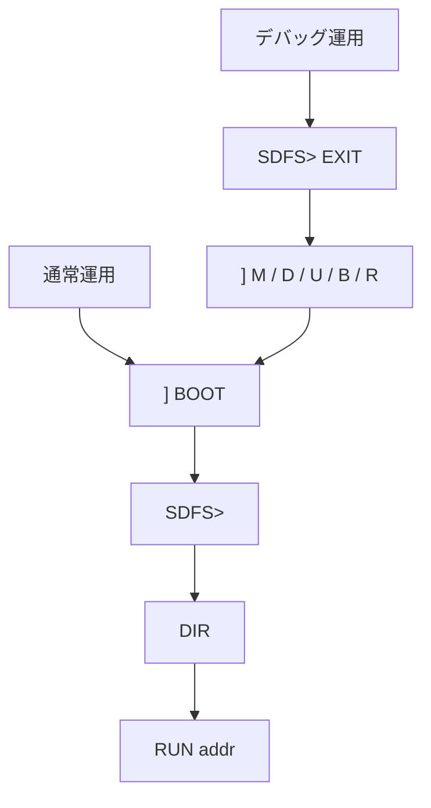

# SDFS/68 システムSDカード方針

この文書は、SDFS/68 用のシステムSDカードを作るための初期方針をまとめる。
ここに書く `DIR`、`TYPE`、`RUN`、`LOAD`、`L`、`EXIT` は、ROMモニタの `] ` プロンプトで使うコマンドではなく、SDFS/68起動後の `SDFS> ` プロンプトで使うコマンドである。

SDFS/68 は、ROM モニタの `BOOT` から起動する第2段システムである。ROM は固定LBAからstage1 loaderを読み、stage1がFAT root の `SDFS.BIN` を読み込む。
ROM単体ではメモリ変更、メモリダンプ、指定アドレス実行、マシン語デバッグを行い、通常のSDファイル操作はSDFS/68へ寄せる。



## 基本方針

- 初期方式は fixed boot area のstage1 loader起動とする。
- SDFS/68本体は root directory の通常ファイル `SDFS.BIN` とする。
- ROMはFATを読まず、stage1がFAT32 read-only最小実装で `SDFS.BIN` を読む。
- 初期 SDFS/68 は read-only とし、FAT write や SAVE は別Issueで扱う。
- 8.3 short filename を前提にする。LFN とサブディレクトリは後続段階で扱う。
- SDFS/68はROMモニタの拡張コマンドではなく、小さい第2段DOSとして扱う。
- ROMモニタは救命具、デバッガ、復旧口として残し、SDFS/68内にモニタ機能を再実装しない。

## system SD が必要な範囲

| 操作 | system SD | 所属 |
| --- | --- | --- |
| ROMモニタ起動、`D` / `M` / `G` / `L` / `B` / `C` / `R` / `U` | 不要 | ROMモニタ |
| ROM `BOOT` でSDFS/68へ移行 | 必要 | ROM入口 + stage1 |
| SDFS/68の `DIR` / `TYPE` / `RUN` / `LOAD` / `EXIT` | 必要 | SDFS/68 |
| 直接指定ROMのROM常駐FAT `DIR` / `LF` | SDFS/68用system SDは不要。ただしFAT32 SDカードは必要 | ROM互換FAT |

ROM常駐FATは `FEATURE_SD=1 FEATURE_FAT=1` を直接指定したときだけ使う互換機能であり、SDFS/68本線ではない。
ここで不要としているのは、fixed boot area のstage1と root の `SDFS.BIN` を含むSDFS/68用system SDである。
ROM常駐FAT `DIR` / `LF` を使う場合でも、FAT32形式のSDカード自体は別途必要である。
標準profileではROM常駐FATを外し、`FEATURE_SD=1 FEATURE_FAT=0` の構成は `BOOT` でSDFS/68へ移行してからSD上ファイルを扱う。
この構成は `sbcio_vdg` / `k6802_vdg` のprofileで使えるほか、VDGなしのSBC-IOでも `MONITOR_PROFILE=sbcio FEATURE_SD=1 FEATURE_FAT=0 BUILD_CONFIG_NAME=sbcio-sdfs` のように軸指定で作れる。

## システムSDイメージ生成

初期ツール名は `tools/mk_sdfs_image.py` とする。

ツールは Mac / Windows / Linux で同じ Python コードを使い、FAT32 SDイメージファイルを生成する。実SDカードへの直接書き込みは行わない。

基本形:

```console
python3 tools/mk_sdfs_image.py --stage1 STAGE1.BIN --sdfs SDFS.BIN --output sdfs.img SRC/HELLO.S SRC/HELLO.HEX BIN/HELLO.COM
```

Windows では `python` コマンドを使う環境もある。

```powershell
python tools\mk_sdfs_image.py --stage1 STAGE1.BIN --sdfs SDFS.BIN --output sdfs.img SRC\HELLO.S SRC\HELLO.HEX BIN\HELLO.COM
```

入力候補:

- stage1 loader binary
- `SDFS.BIN`
- S-Record ファイル (`.S`)
- Intel HEX ファイル (`.HEX`)
- バイナリファイル (`.BIN`)
- 将来の画像や固定データファイル

出力:

- FAT32 形式の SDイメージファイル。
- partition開始前の physical LBA `16` 以降にstage1 loaderを配置する。
- FAT32 partition は既定で physical LBA `32` から開始する。
- 既定出力はホストOSがFAT32として扱えるクラスタ数を持つ。
- root directory に `SDFS.BIN` を配置し、相対パス付きの指定ファイルは対応するサブディレクトリに配置する。
- テスト用には小さい決定的イメージを生成できるようにする。

stage1 boot area は FAT32 reserved sector ではない。ROMはFATを見ずに physical LBA `16` からstage1を読み、stage1がFAT rootの `SDFS.BIN` を読む。

## 実SDカードへの書き込み

実SDカードへの書き込みは、初期ツールの責務に含めない。

Mac / Linux では `dd` や OS 標準のディスク操作でイメージを書き込む。Windows では既存のイメージ書き込みツールを使う。

直接デバイス書き込みをツールに含めない理由:

- 管理者権限が必要になる。
- デバイス指定ミスで別ディスクを破壊する危険がある。
- Mac / Windows / Linux でデバイス列挙と権限モデルが大きく違う。

## 推奨ファイル配置

V1.3では `SDFS.BIN` をroot directoryへ置いたまま、利用者ファイルをサブディレクトリへ整理できる。

| ファイル | 用途 |
| --- | --- |
| fixed boot area | stage1 loader。ROMが固定LBAから読む |
| `SDFS.BIN` | SDFS/68 本体。stage1がFAT rootから読む |
| `SRC/HELLO.S` | S-Record LOAD / RUN 確認用 |
| `SRC/HELLO.HEX` | Intel HEX LOAD 確認用 |
| `BIN/HELLO.COM` | `.COM` トランジェントコマンド確認用 |
| `DATA/` | データファイル配置候補 |
| `DOC/` | テキストや説明資料の配置候補 |
| `AUTOEXEC.S` | 将来の任意起動スクリプト候補 |

`SDFS.BIN` は stage1 が固定名で探すため、V1.3でもroot directory直下に置く。
`AUTOEXEC.S` は現時点の必須ファイルではない。ROM 側 `BOOT` は `AUTOEXEC.S` を直接読まない。

## SDFS/68 v1 コマンド

SDFS/68 v1 は最小シェルとして `SDFS> ` プロンプトを表示する。

| コマンド | 用途 |
| --- | --- |
| `L filename` | FAT root の8.3 short filenameファイルをS-RecordまたはIntel HEXとしてロードする |
| `Dhhhh` | 16bit hexadecimal address の1 byteを表示する。ロード確認用の最小コマンド |

SDFS/68 v1 の `L filename` は、ROMモニタの `L` コマンドをそのままSD対応にしたものではない。
ROM `BOOT` 後にSDFS/68上で動くロード手段であり、stage1 boot servicesを使ってroot上のファイルを読む。

例:

```text
SDFS> LOAD HELLO.S
OK
SDFS> L HELLO.HEX
OK
SDFS> D0200
0200 86
```

存在しないファイル、壊れたHEX、終端recordなしのファイルでは `?` または `?S5` / `?I5` のようなloader stage付きエラーを表示し、プロンプトへ戻る。

SDFS/68 v1 のloaderは ROM loader と同じ制限を持つ。S-Recordは `S1` / `S2` のデータrecordを扱い、`S2` は上位 1 byte が `0` の場合だけ有効である。Intel HEX は record type `00` と `01` のみ対応し、拡張アドレスrecordは扱わない。

SDFS/68 v1 はloaderの書き込み先アドレスを保護しない。`SDFS.BIN` 本体、stage1、SD/FAT work、stack、VDG VRAMなどを壊すファイルも指定できるため、当面は作成者がロード先を管理する。

## SDFS/68 v2 コマンド

SDFS/68 v2以降では、DOS風の通常操作を本線にする。
SDFS/68 V1.3ではサブディレクトリとroot起点の明示path指定を追加し、起動時は `SDFS/68 V1.3 #293` のように表示する。
`#293` は直近の修正Issue番号をbuild番号相当として扱う。
SDFS.BIN headerのversion byteはstage1が読むバイナリ形式versionであり、起動表示のバージョンとは別に扱う。

| コマンド | 用途 |
| --- | --- |
| `DIR [path]` | 実装済み。FAT directory の8.3通常ファイルと通常ディレクトリを表示する |
| `TYPE filename` | 予定。テキストファイルをコンソールへ表示する |
| `RUN path/file` | 実装済み。S-Recordファイルをロードし、entry recordがあれば実行する |
| `RUN addr` | 実装済み。16bit hexadecimal address へジャンプする |
| `LOAD path/file` | 実装済み。ファイルをロードする。自動実行しない |
| `L path/file` | 実装済み。`LOAD path/file` の短縮エイリアス |
| `path/FOO.COM [args]` | 実装済み。`.COM` トランジェントコマンドをロードして実行する |
| `Dhhhh` | 実装済み。16bit hexadecimal address の1 byteを表示する |
| `EXIT` | 実装済み。ROMモニタへ戻る |

SDFS/68の行入力はROMモニタ相当に寄せ、BS / DELで入力中の1文字を削除できる。
行頭でのBS / DELは無視する。
コマンド名、8.3ファイル名、path componentは小文字でも入力できる。

V1.3のpath指定は毎回root directoryを起点にたどる。
`/SRC/HELLO.S` と `SRC/HELLO.S` はどちらもrootの `SRC` から始まる明示pathとして扱う。
カレントディレクトリ、`CD`、`PWD`、相対path、`.`、`..`、wildcard、LFNは扱わない。
末尾 `/`、空component、`//`、path内の空白はエラーとして `?` を表示する。

`DIR` はSDFS/68本体がstage1の既存低レベルサービスを使ってdirectoryを走査する。
stage1に `DIR` 専用APIは追加せず、ROM側の `DIR` も呼ばない。

表示例:

```text
SDFS> DIR
SDFS.BIN A 0000092F
SRC D 00000000
BIN D 00000000
SDFS> DIR /SRC
HELLO.S A 0000004A
HELLO.HEX A 00000022
```

`DIR` が表示するのは、8.3 short filenameの通常ユーザーファイルと通常ディレクトリである。
属性欄は通常ファイルを `A`、ディレクトリを `D` として表示する。
LFN、volume label、hidden、system、deleted entry、`.`、`..` は表示しない。
ファイル名に制御文字や非ASCIIが混じるentryも表示しない。
MacでSDカードをマウントしたときにできるAppleDouble風の副産物は、hidden属性付きの短縮名として見える場合があり、SDFS/68の `DIR` では表示しない。
wildcard、属性詳細表示、FAT writeは対象外である。

通常実行は `RUN` を使う。
`LOAD` / `L` はロード確認やデバッグ用の補助コマンドとして扱う。
`LOAD` はロードのみを行い、自動ジャンプしない。

例:

```text
SDFS> RUN HELLO.S
SDFS> LOAD /SRC/HELLO.HEX
SDFS> /BIN/HELLO.COM
SDFS> /BIN/ARGS.COM AAA BBB
```

`RUN path/file` はS-Record専用である。
`S9` / `S8` のentry recordがある場合だけ、ロード後にそのアドレスへジャンプする。
Intel HEXはアセンブラがstart address recordを出さない環境が多いため、SDFS/68 V1.2では `RUN filename` の対象外とする。
Intel HEXを実行したい場合は、`LOAD path/file` でロードしてから `RUN addr` で明示アドレスへジャンプする。

`RUN addr` は指定アドレスへ直接ジャンプする。プログラム終了後にSDFS/68へ戻る保証はない。
ROMモニタの `G addr` 相当の実行入口として扱う。

`.COM` トランジェントコマンドは `RUN` とは別の復帰前提ABIである。
`FOO.COM` や `/BIN/FOO.COM` のように拡張子まで明示して入力すると、SDFS/68 は raw binary を `$0100` へ固定ロードし、`JSR $0100` 相当で起動する。
`.COM` 側は `RTS` で SDFS/68 へ戻る。
`FOO.COM AAA BBB` や `/BIN/FOO.COM AAA BBB` のように引数を付けた場合、SDFS/68 は `X` / `B` で引数テールを渡す。
詳細は [SDFS/68 .COM トランジェントコマンドABI](../design/sdfs68_com_abi.md) を参照する。

メモリ変更、ブレークポイント、逆アセンブルなどの低レベルデバッグはSDFS/68に取り込まず、`EXIT` でROMモニタへ戻って行う。
ROMへ戻った後は `] ` プロンプトで `M`、`D`、`U`、`B`、`R` などを使い、必要に応じて再度 `BOOT` する。
`EXIT` はROMモニタの再入口へ戻る通常終了口であり、SDFS/68へ戻る常駐復帰機構ではない。
ACIAは再初期化せず、ROMモニタの `] ` プロンプトへ戻る。

## 将来拡張

SDFS/68 v2 以降では、既存 FAT32 カードへ必要ファイルをコピーする補助ツールを追加できる。

SDFS/68 v4 以降では、画像や固定バイナリデータをSD上に置き、ファイル全体をLOADせずに sector / offset 単位で読む direct read API を検討する。
